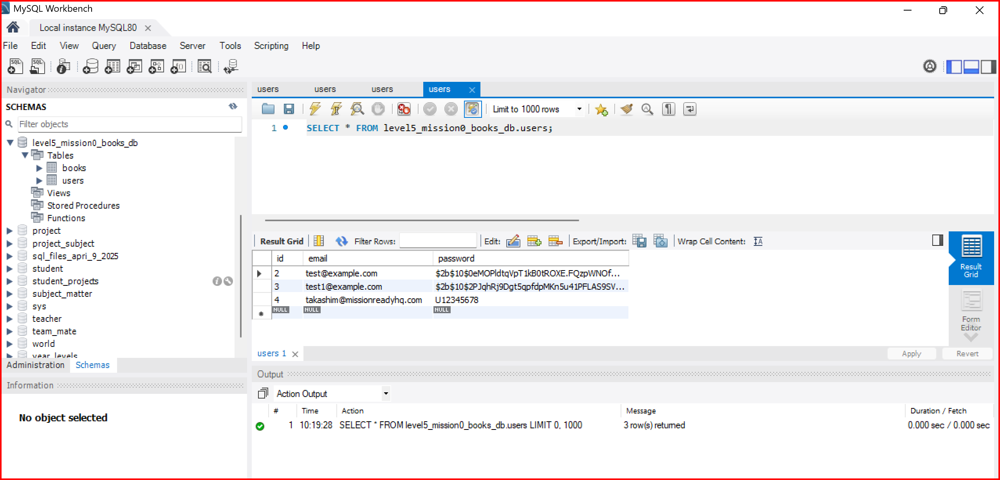

# Database Setup for Amazing Books Application

## Overview
This README provides instructions for setting up the database for the Amazing Books Application. It includes the SQL commands needed to create the database, tables, and initial data.



## Database Creation

### SQL Commands

1. **Create Database**:
   ```sql
   CREATE DATABASE level5_mission0_books_db;

2. **Use the Database**:
   ```sql
    USE level5_mission0_books_db;

3. **Create Users Table**:
    ```sql
    CREATE TABLE users (
        id INT AUTO_INCREMENT PRIMARY KEY, -- User ID
        email VARCHAR(255) NOT NULL UNIQUE, -- User Email (must be unique)
        password VARCHAR(255) NOT NULL -- User Password
);

4. **Insert Initial User Data**:
    ```sql
    INSERT INTO users (email, password) VALUES ('takashim@missionreadyhq.com', 'U12345678');

5. **Select Users**:
    ***To retrieve user data, you can use the following queries***:
     ```sql
    CREATE TABLE users (
    id INT AUTO_INCREMENT PRIMARY KEY, -- User ID
    email VARCHAR(255) NOT NULL UNIQUE, -- User Email (must be unique)
    password VARCHAR(255) NOT NULL -- User Password
);

6. ***Delete All Users***:
    ```sql
    DELETE FROM users;

7. **Truncate Users Table**:
    ```sql
    TRUNCATE TABLE users;

8. **Show All Users**:
    ```sql
    SELECT * FROM users;

9. **Show Grants for the Root User**:
    ```sql
    SHOW GRANTS FOR 'root'@'localhost';

*Usage*
***Run the SQL commands in your preferred SQL client or command line interface to set up the database and the users table.***

*License*
***This project is licensed under the MIT License. See the LICENSE file for details.***

*Acknowledgments*
***Please use this template to add any project-specific information as needed. If you have any questions, feel free to let me know!***


